<picture>
    <source media="(prefers-color-scheme: dark)" srcset="images/microchip_logo_white_red.png">
    <source media="(prefers-color-scheme: light)" srcset="images/microchip_logo_black_red.png">
    
</picture>

## Triple Motor Control of PMSMs with dsPIC33AK512MC510 using Sensorless FOC and PLL Estimator 

## 1. INTRODUCTION
This document describes the setup requirements for driving **three** Permanent Magnet Synchronous Motors (PMSM) with [dsPIC33AK512MC510](https://www.microchip.com/en-us/product/dsPIC33AK512MC510), using Sensorless Field Oriented Control (FOC) and PLL Estimator Algorithm. The demonstration is set up on the hardware platform [EV18H47A](https://www.microchip.com/en-us/development-tool/ev18h47a) "MCLV-48V-300W Development Board"  and [EV67N21A](https://www.microchip.com/en-us/development-tool/ev67n21a) "dsPIC33AK512MC510 Motor Control Dual In-line Module (DIM)".

In this application example, the first motor is run using the inverter stage available on the MCLV-48V-300W Development Board, as the board is designed to directly control only one three-phase motor. To control the second and third motors, additional inverter card must be connected to the XPRO1 connector (J11) on the development board. For details regarding the pin mapping of control signals for the second and third motor, please refer to [Appendix A](#71-appendix-a-pin-mapping-for-second-and-third-motor-control-signals).

The application showcases the Sync PCI feature of PWM peripheral to synchronize the PWM signals for triple motor control. See [Appendix B](#72-appendix-b-pwm-synchronization-for-triple-motor-control) for the PWM synchronization diagram.

For details about PLL estimator, refer to Microchip application note [AN1292](https://ww1.microchip.com/downloads/aemDocuments/documents/OTH/ApplicationNotes/ApplicationNotes/01292A.pdf) “Sensorless Field Oriented Control (FOC) for a Permanent Magnet Synchronous Motor (PMSM) Using a PLL Estimator and Field Weakening (FW)”

Enhance your embedded applications with Microchip's high-performance [dsPIC® Digital Signal Controllers (DSCs)](https://www.microchip.com/en-us/products/microcontrollers-and-microprocessors/dspic-dscs). Visit our [Motor Control and Drive page](https://www.microchip.com/en-us/solutions/technologies/motor-control-and-drive) to stay updated on the latest motor control solutions from Microchip.

The below figure illustrates the inteconnections that can be used to interface the external inverters through XPRO#1 connector.
     

     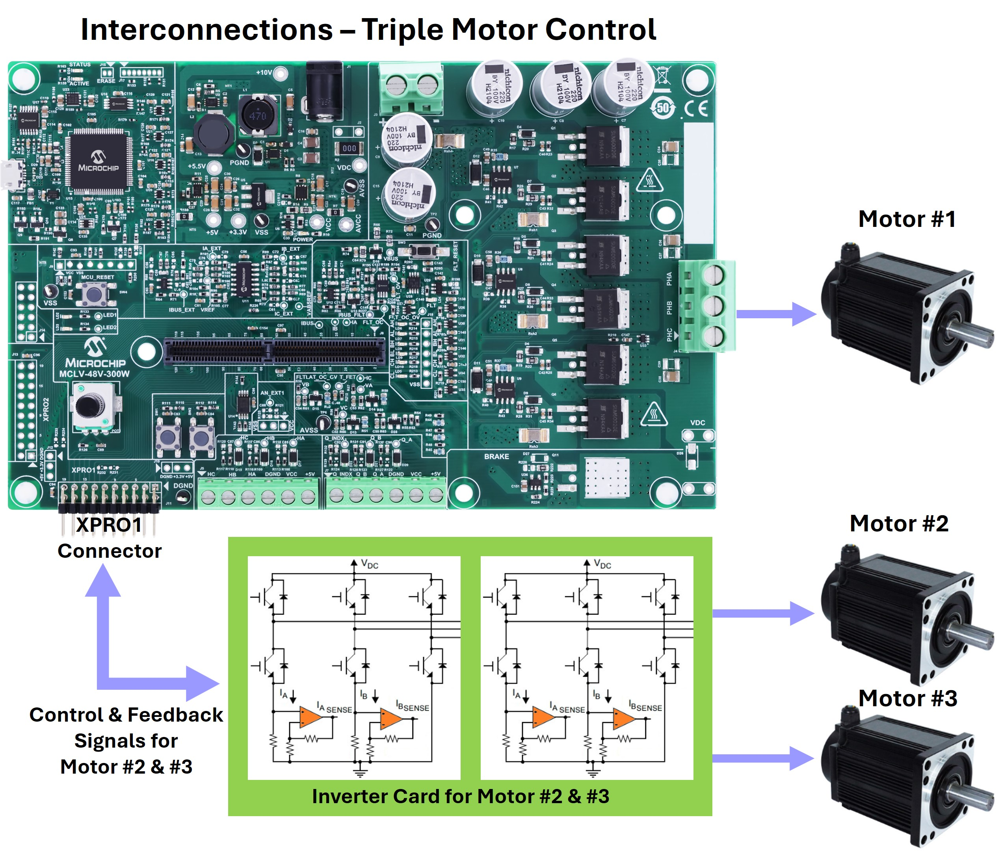

> **Note:**  
>The inverters for Motor #2 and #3 are not supplied by Microchip. For operating Motor #2 and Motor #3, additional MCLV‑48V‑300W boards were interfaced to the primary MCLV‑48V‑300W board through the XPRO#1 connector.

> **Note:**  
>The [dsPIC33AK512MC510](https://www.microchip.com/en-us/product/dsPIC33AK512MC510) is a Digital Signal Controller (DSC) from Microchip Technology and part of the [dsPIC33AK512MPS512](https://www.microchip.com/en-us/product/dsPIC33AK512MPS512) family, designed for motor control and other high-performance embedded system applications.
 

## 2. SUGGESTED DEMONSTRATION REQUIREMENTS

### 2.1 Motor Control Application Firmware Required for the Demonstration

To clone or download this application firmware on GitHub, 
- Navigate to the [main page of this repository](https://github.com/microchip-pic-avr-solutions/mclv48v300w-33ak512mc510-pmsm-an1292-foc-pll-triple-motor) and 
- On the tab **<> Code**, above the list of files in the right-hand corner, click Code, then from the menu, click **Download ZIP** or copy the repository URL to **clone.**
> **Note:**  
>In this document, hereinafter this firmware package is referred as **firmware.**
### 2.2 Software Tools Used for Testing the firmware

- MPLAB® X IDE **v6.25** 
- Device Family Pack (DFP): **dsPIC33AK-MC_DFP v1.2.125**
- Curiosity/Starter Kits Tool Pack : **PKOB4_TP v1.22.1668**
- MPLAB® XC-DSC Compiler **v3.30**
- MPLAB® X IDE Plugin: **X2C-Scope v1.7.0** 
> **Note:**  
>The software used for testing the firmware prior to release is listed above. It is recommended to use these or later versions of the tool for building the firmware. All previous versions of Device Family Packs (DFP) and Tool Packs can be downloaded from [Microchip Packs Repository.](https://packs.download.microchip.com/)
### 2.3 Hardware Tools Required for the Demonstration
- MCLV-48V-300W Development Board [(EV18H47A)](https://www.microchip.com/en-us/development-tool/ev18h47a)
- dsPIC33AK512MC510 Motor Control Dual In-line Module [(EV67N21A)](https://www.microchip.com/en-us/development-tool/ev67n21a)
- 24V DC Power Supply (current rating of supply should meet the triple motor requirement)
- Additional Inverter Card for second and third motor 
- 24V 3-Phase Brushless DC Motor - Hurst DMA0204024B101 [(AC300022)](https://www.microchip.com/en-us/development-tool/AC300022) or,
- 24V 3-Phase Brushless DC Motor - Hurst DMB0224C10002 [(AC300020)](https://www.microchip.com/en-us/development-tool/AC300020) or,
- 24V 3-Phase Leadshine Servo Motor [(ELVM6020V24FH-B25-HD)](https://www.leadshine.com/product-detail/ELVM6020V24FH-B25-HD.html) or,
- 24V 3-Phase ACT Brushless DC Motor [(ACT 57BLF01)](https://www.act-motor.com/brushless-dc-motor-57blf-product/) or,
- 24V 3-Phase ACT Brushless DC Motor [(ACT 57BLF02)](https://www.act-motor.com/brushless-dc-motor-57blf-product/)

> **Note:**  
> [EV18H47A](https://www.microchip.com/en-us/development-tool/ev18h47a), [EV67N21A](https://www.microchip.com/en-us/development-tool/ev67n21a), [AC300022](https://www.microchip.com/en-us/development-tool/AC300022),  and [AC300020](https://www.microchip.com/en-us/development-tool/AC300020) are available at [microchip DIRECT](https://www.microchipdirect.com/). The motors are referred as follows in the firmware
>- Hurst DMA0204024B101(AC300022) is referred as Hurst300 or Long Hurst
>- Hurst DMB0224C10002(AC300020) is referred as Hurst075 or Short Hurst
>- Leadshine Servo Motor ELVM6020V24FH-B25-HD is referred as leadshine24v
>- ACT 57BLF01 motor is referred as act57blf01
>- ACT 57BLF02 motor is referred as act57blf02

> **Note:**  
 >- The first motor control is referred as **MC1** in the firmware
 >- The second motor control is referred as **MC2** in the firmware
 >- The third motor control is referred as **MC3** in the firmware
 

## 3. HARDWARE SETUP
This section describes the hardware setup required for the demonstration.
> **Note:**  
>In this document, hereinafter the MCLV-48V-300W Development Board is referred as **development board**. Refer the [MCLV-48V-300W Inverter Board User's Guide](https://ww1.microchip.com/downloads/aemDocuments/documents/MCU16/ProductDocuments/UserGuides/Motor-Control-Low-Voltage-48V-300W-Inverter-Board-Users-Guide-DS50003297.pdf) for more information about the development board.

1. For the first motor, the currents are amplified on the MCLV-48V-300W development board; it can also be amplified by the amplifiers internal to the dsPIC33AK512MC510 on the DIM. The firmware and DIM are configured to sample and convert internal amplifier outputs (**'internal op-amp configuration'**) by default to measure the motor currents needed to implement FOC for the first motor. **Table-1** summarizes the resistors to be populated and removed to convert the DIM from **‘internal op-amp configuration’** to **‘external op-amp configuration’** or vice versa.

     

     

2. Insert the **dsPIC33AK512MC510 Motor Control DIM** into the DIM Interface **connector J8** on the development board. Make sure the DIM is placed correctly and oriented before going ahead.

     

     

3. Insert the additional inverter card for second and third motor in the **XPRO1 connector(J11)**. Refer [Appendix A](#71-appendix-a-pin-mapping-for-second-and-third-motor-control-signals) for pin mapping.

     

      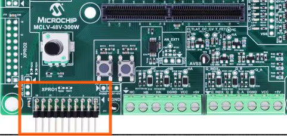

4. Connect the 3-phase wires from the first motor to PHC, PHB, and PHA of the **connector J4**(no specific order), provided on the development board. The other two motors need to be connected to the additional inverter card plugged on to the XPRO1(J11) connector. Refer to [Appendix A](#71-appendix-a-pin-mapping-for-second-and-third-motor-control-signals) for pin mapping of control signals.

     

      

5. Plug the 24V DC power supply to **connector J3** on the development board. Alternatively, the development board can also be powered through connector J1, if the current consumption is less than **2.5A**.
      

      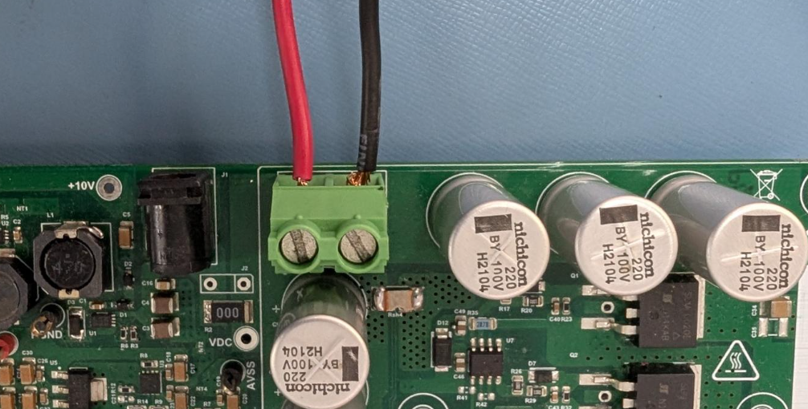

 

6. The board has an onboard programmer **PICkit™ On Board (PKoBv4)** , which can be used for programming or debugging the microcontroller or dsPIC DSC on the DIM. To use the onboard programmer, connect a micro-USB cable between the Host PC and **connector J16** on the development board.
      

     

     Alternatively, connect the Microchip programmer/debugger MPLAB® PICkit™ 5 In-Circuit Debugger[(PG164150)](https://www.microchip.com/en-us/development-tool/pg164150) between the Host PC used for programming the device and the **ICSP header J9** on the development board (as shown). Ensure that PICkit 5 is oriented correctly before proceeding.
      

       

  

## 4. SOFTWARE SETUP AND RUN
### 4.1 Setup: MPLAB X IDE and MPLAB XC-DSC Compiler
Install **MPLAB X IDE** and **MPLAB XC-DSC Compiler** versions that support the device **dsPIC33AK512MC510** and **PKoBv4.** The MPLAB X IDE, MPLAB XC-DSC Compiler, and X2C-Scope plug-in used for testing the firmware are mentioned in the [Motor Control Application Firmware Required for the Demonstration](#21-motor-control-application-firmware-required-for-the-demonstration) section. 

To get help on  

- MPLAB X IDE installation, refer [link](https://developerhelp.microchip.com/xwiki/bin/view/software-tools/ides/x/install-guide/)
- MPLAB XC-DSC Compiler installation steps, refer [link](https://developerhelp.microchip.com/xwiki/bin/view/software-tools/xc-dsc/install/)

If MPLAB IDE v8 or earlier is already installed on your computer, then run the MPLAB driver switcher (Installed when MPLAB®X IDE is installed) to switch from MPLAB IDE v8 drivers to MPLAB X IDE drivers. If you have Windows 8 or 10, you must run the MPLAB driver switcher in **Administrator Mode**. To run the Device Driver Switcher GUI application as administrator, right-click on the executable (or desktop icon) and select **Run as Administrator**. For more details, refer to the MPLAB X IDE help topic **“Before You Begin: Install the USB Device Drivers (For Hardware Tools): USB Driver Installation for Windows Operating Systems.”**

### 4.2 Setup: X2C-SCOPE
X2C-Scope is a MPLAB X IDE plugin that allows developers to interact with an application while it runs. X2C-Scope enables you to read, write, and plot global variables (for motor control) in real-time. It communicates with the target using the UART. To use X2C-Scope, the plugin must be installed. To set up and use X2C-Scope, refer to the instructions provided on the [web page](https://x2cscope.github.io/docs/MPLABX_Plugin.html).

## 5.  BASIC DEMONSTRATION
### 5.1 Firmware Description
The firmware version needed for the demonstration is mentioned in the section [Motor Control Application Firmware Required for the Demonstration](#21-motor-control-application-firmware-required-for-the-demonstration). This firmware is implemented to work on Microchip’s Digital Signal Controller (dsPIC® DSC) [dsPIC33AK512MC510](https://www.microchip.com/en-us/product/dsPIC33AK512MC510). For more information, see the **dsPIC33AK512MPS512 Family datasheet [(DS70005591)](https://ww1.microchip.com/downloads/aemDocuments/documents/MCU16/ProductDocuments/DataSheets/dsPIC33AK512MPS512-Family-Data-Sheet-DS70005591.pdf)**.

The Motor Control Demo application runs **three** PMSM motors using a single dsPIC DSC [dsPIC33AK512MC510](https://www.microchip.com/en-us/product/dsPIC33AK512MC510) controller. This application uses the following interfaces to run all the three motors,
- Push button **SW1** to start or stop the motors
- Push button **SW2** to change the direction of rotation of the motor 
- Potentiometer **POT1**  to vary the speed of the motor. 

The application configures and uses peripherals like PWM, ADC, OP-AMP, CMP, DAC, UART etc.

> **Note:** 
> The project may not build correctly in Windows OS if the Maximum path length of any source file in the project is more than 260 characters. In case the absolute path exceeds or nears the maximum length, do any (or both) of the following:
> - Shorten the directory name containing the firmware used in this demonstration. If you renamed the directory, consider the new name while reading the instructions provided in the upcoming sections of the document.
> - Place firmware in a location such that the total path length of each file included in the projects does not exceed the Maximum Path length specified.  
> Refer to MPLAB X IDE help topic **“Path, File, and Folder Name Restrictions”** for details. 

### 5.2 Basic Demonstration
Follow the below instructions, step by step, to set up and run the motor control demo application:

1. Start **MPLAB X IDE** and open the project **pmsm.X (File > Open Project)** with device selection **dsPIC33AK512MC510.**  
    

       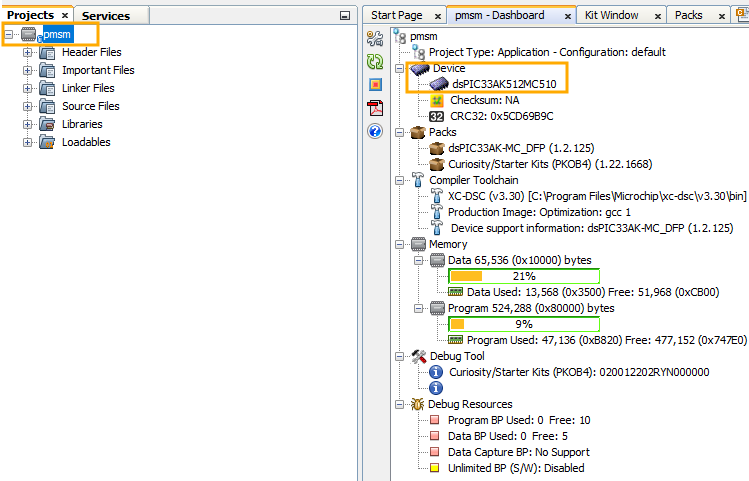

  

2. Set the project **pmsm.X** as the main project by right-clicking on the project name and selecting **Set as Main Project** as shown. The project **pmsm.X** will then appear in **bold.**
    

     

 

3. Open the respective motor's user parameter header file - example for first motor - <code>**mc1_user_params.h** </code> (**pmsm.X > Header Files > mc1**) in the project **pmsm.X.**  
     - Ensure the macro <code>**OPEN_LOOP_FUNCTIONING</code>** is **undefined** to run the motor in closed loop speed control
          

     - **Define** the macro to a corresponding number(1 to 5) to select the motor. To achieve optimal performance under loaded conditions, the control parameters in the firmware may need additional tuning. A new motor can be added by duplicating and modifying any existing motor's header file.
          
 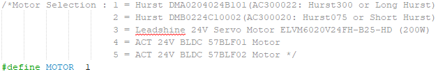

          
     - By default, the macro <code>**FLUX_WEAKENING_VARIANT**</code> is **defined** to **1**, enabling the flux weakening control through a PI controller that limits the voltage circle using voltage feedback. **Define** the macro to **2** to enable the flux weakening using reference speed feed-forward control based on PMSM steady state equations. The flux weakening can be disabled by **defining** the macro to **0**.
          
 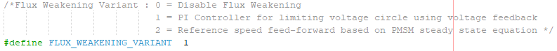

4. Open the <code>**board_service.h**</code> (**pmsm.X > Header Files > hal**),
     - When internal amplifiers are used for current amplification of first motor (referred to as **internal op-amp configuration**), **define** the macro <code>**INTERNAL_OPAMP_CONFIG_MC1**</code>
          
 

     - Otherwise, if external amplifiers are used for current amplification of first motor (referred to as **external op-amp configuration**), undefine the macro <code>**INTERNAL_OPAMP_CONFIG_MC1**</code>
        

 

5. Right-click on the project **pmsm.X** and select **Properties** to open its **Project Properties** Dialog. Click the **Conf:[default]** category to reveal the general project configuration information. The development tools used for testing the firmware are listed in section [2.2 Software Tools Used for Testing the firmware.](#22-software-tools-used-for-testing-the-firmware)

     In the **Conf:[default]** category window: 
     - Ensure the selected **Device** is **dsPIC33AK512MC510.**
     - Select the **Connected Hardware Tool** to be used for programming and debugging. 
     - Select the specific Device Family Pack (DFP) from the available list of **Packs.** In this case, **dsPIC33AK-MC_DFP 1.2.125** is selected. 
     - Select the specific **Compiler Toolchain** from the available list of **XC-DSC** compilers. 
     In this case, **XC-DSC(v3.30)** is selected.
     - After selecting Hardware Tool and Compiler Toolchain, Device Pack, click the button **Apply**

     Please ensure that the selected MPLAB® XC-DSC Compiler and Device Pack support the device configured in the firmware

     

     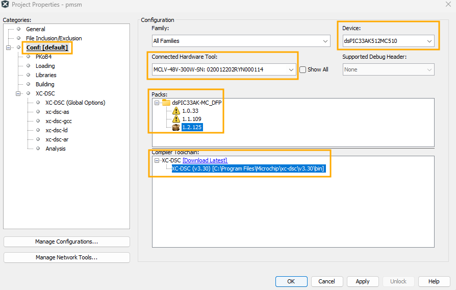

6. Ensure that the checkbox **Load symbols when programming or building for production (slows process)** is checked under the **Loading** category of the **Project Properties** window.       
        
      

      

     Also, go to **Tools > Options** , and
           
      

      

      
    Open the  **Embedded > Generic Settings** tab and ensure that the **ELF debug session symbol load methodology (MIPS/ARM)** is selected as **Pre-procesed (Legacy)** from the drop down.
           
      

      

7. To build the project (in this case, **pmsm.X**) and program the device dsPIC33AK512MC510, click **Make and Program Device Main project** on the toolbar
    

    

  
8. If the device is successfully programmed, **LED1 (LD2)** will be **blinking**, indicating that the dsPIC® DSC is enabled.
    

     

9. Run or stop the motor by pressing the push button **SW1.** The motor should start spinning smoothly in one direction in the nominal speed range. Ensure that the motor is spinning smoothly without any vibration. The LED **LED2(LD3)** is turned **ON** to show the button is pressed to start the motor.The specified motor is tested under no load conditions. To achieve optimal performance under loaded conditions, the control parameters in the firmware may need additional tuning.
     

     

 
10. The motor speed can be varied using the potentiometer **(POT1).**
    

    

 
11. Press the push button **SW2** to change the direction of rotation of motor.
     

     
 

12. Press the push button **SW1** to stop the motor.

>**Note:** 
>The macros <code>NOMINAL_SPEED_RPM</code> and <code>MAXIMUM_SPEED_RPM</code> are defined in the respective motor header files as per the Motor manufacturer’s specifications. Exceeding manufacture's specifications may damage the motor or the board or both.

## 5.3  Data visualization through X2C-Scope Plug-in of MPLAB X

X2C-Scope is a third-party plug-in in MPLAB X, which helps in real-time diagnostics. The application firmware comes with the initialization needed to interface the controller with the host PC to enable data visualization through the X2C-Scope plug-in. Ensure the X2C-Scope plug-in is installed. For more information on how to set up a plug-in, refer to either the [Microchip Developer Help page](https://developerhelp.microchip.com/xwiki/bin/view/software-tools/ides/x/plugins) or the [web page.](https://x2cscope.github.io/docs/MPLABX_Plugin.html)
 
1. To establish serial communication with the host PC, connect a micro-USB cable between the host PC and **connector J16** on the development board. This interface is also used for programming.

2. Ensure the application is configured and running as described under section [5.2 Basic Demonstration](#52-basic-demonstration) by following steps 1 through 11.

3. Open the **X2C-Scope** window by selecting **Tools>Embedded>X2CScope.**
      

       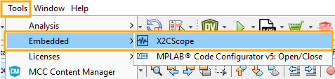

 

4. **In the X2C-Scope Configuration** window, open the **Connection Setup** tab and click **Select Project.** This opens the drop-down menu **Select Project** with a list of opened projects. Select the specific project **pmsm** from the list of projects and click **OK.**
    

    

5. To configure and establish the serial communication for **X2C-Scope**, open the **X2CScope Configuration** window, click on the **Connection Setup** tab and:
     - Set **Baudrate** as **115200**, which is configured in the application firmware. 
     - Click on the **Refresh** button to refresh and update the list of the available Serial COM ports connected to the Host PC. 
     - Select the specific **Serial port** detected when interfaced with the development board. The **Serial port** depends on the system settings

    

     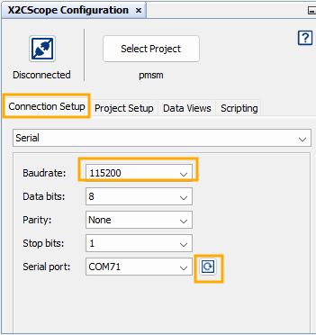

 

6. Once the **Serial port** is detected, click on **Disconnected** and turn to **Connected**, to establish serial communication between the Host PC and the board.
     

    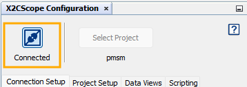

7. Open the **Project Setup** tab in the **X2CScope Configuration** window and,
     - Set **Scope Sampletime** as the interval at which <code>X2CScopeUpdate()</code> is called. In this application, the function is called in every ADC ISR of first motor(**pmsm.X > Source Files > mc1 >** <code>**mc1_service.c</code>**), which is around <code>62.5µs.</code> 
     - Then, click **Set Values** to save the configuration.

      

      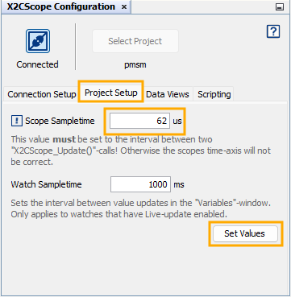

8.	Click on **Open Scope View** (in the **Data Views** tab of the **X2CScope Configuration** Window); this opens **Scope Window.**
     

      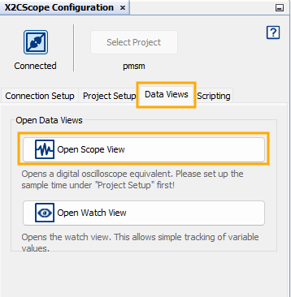

    	     
9. In the **Scope Window**, select the variables that must be watched. To do this, click on the **Source** against each channel, and a window **Select Variables** opens on the screen. From the available list, the required variable can be chosen. Ensure checkboxes **Enable** and **Visible** are checked for the variables to be plotted.
To view data plots continuously, uncheck **Single-shot.** When **Single-shot** is checked, it captures the data once and stops. The **Sample time factor** value multiplied by **Sample time** decides the time difference between any two consecutive data points on the plot.
    

    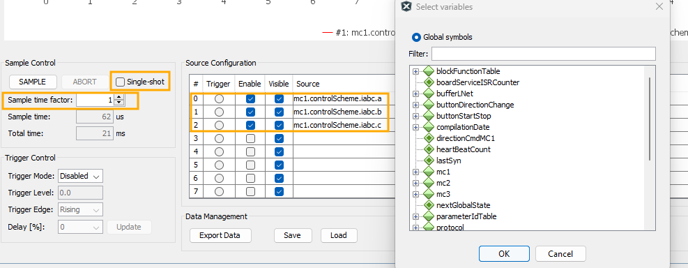

10.	Click on **SAMPLE**, then the X2C-Scope window plots variables in real-time, which updates automatically.
     

     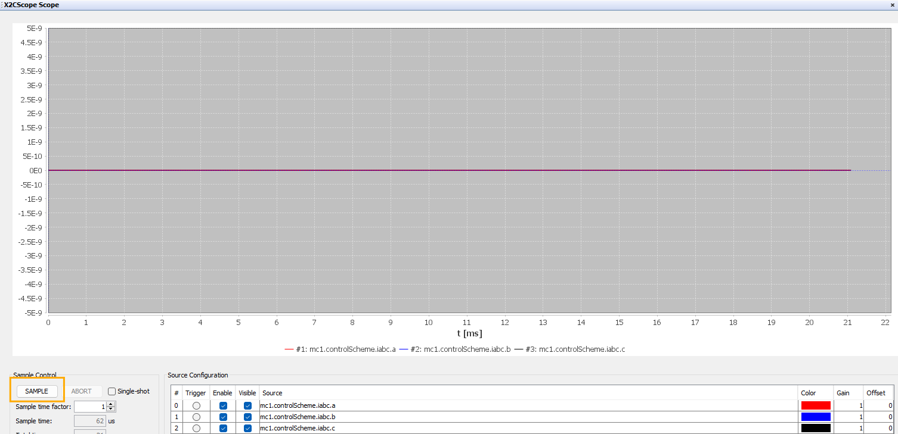

 

11.	Click on **ABORT** to stop.
     

     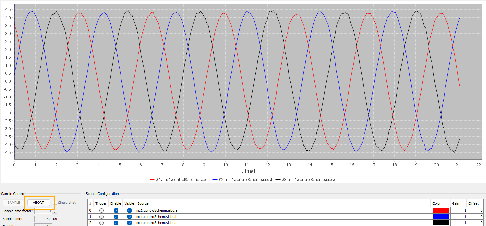

 
 ## 6. REFERENCES:
For additional information, refer following documents or links.
1. AN1292 Application Note “[Sensorless Field Oriented Control (FOC) for a Permanent Magnet Synchronous Motor (PMSM) Using a PLL Estimator and Field Weakening (FW)](https://ww1.microchip.com/downloads/aemDocuments/documents/OTH/ApplicationNotes/ApplicationNotes/01292A.pdf)”
2. MCLV-48V-300W Development Board User’s Guide [(DS50003297)](https://ww1.microchip.com/downloads/aemDocuments/documents/MCU16/ProductDocuments/UserGuides/Motor-Control-Low-Voltage-48V-300W-Inverter-Board-Users-Guide-DS50003297.pdf)
3. dsPIC33AK512MC510 Motor Control Dual In-Line Module (DIM) Information Sheet [(DS70005553)](https://ww1.microchip.com/downloads/aemDocuments/documents/MCU16/ProductDocuments/InformationSheet/dsPIC33AK512MC510-Motor-Control-Dual-In-Line-Module-Information-Sheet-DS70005553.pdf)
4. dsPIC33AK512MPS512 Family datasheet [(DS70005591)](https://ww1.microchip.com/downloads/aemDocuments/documents/MCU16/ProductDocuments/DataSheets/dsPIC33AK512MPS512-Family-Data-Sheet-DS70005591.pdf)
5. MPLAB® X IDE User’s Guide [(DS50002027)](https://ww1.microchip.com/downloads/en/DeviceDoc/50002027E.pdf) or [MPLAB® X IDE help](https://developerhelp.microchip.com/xwiki/bin/view/software-tools/ides/x/)
6. [MPLAB® X IDE installation](https://developerhelp.microchip.com/xwiki/bin/view/software-tools/ides/x/install-guide/)
7. [MPLAB® XC-DSC Compiler installation](https://developerhelp.microchip.com/xwiki/bin/view/software-tools/xc-dsc/install/)
8. [Installation and setup of X2Cscope plugin for MPLAB X](https://x2cscope.github.io/docs/MPLABX_Plugin.html)
9. [Microchip Packs Repository](https://packs.download.microchip.com/)
10. [dsPIC33AK PWM Peripheral Example for Triple Motor Control using Sync PCI Feature](https://mplab-discover.microchip.com/com.microchip.ide.project/com.microchip.mplabx.project.curiosity-33ak512mc510-pwmexample-triple-motor-control)

## 7. APPENDIX
## 7.1 Appendix A: Pin Mapping for Second and Third Motor Control Signals
The below table gives the PWM and Current feedback pin mapping on XPRO1(J11) connector for the second and third motor control.
     

     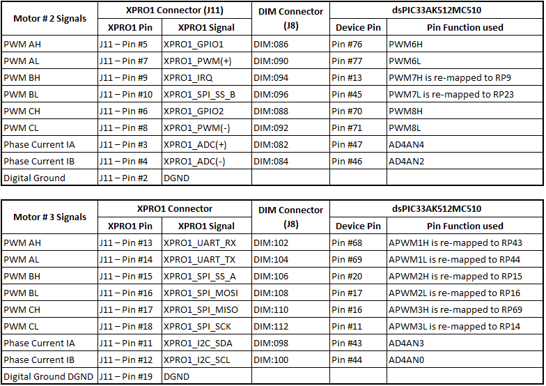

## 7.2 Appendix B: PWM synchronization for triple motor control
- The PWM generator PG5 is dedicated for synchronization, and its outputs are not used for controlling any converter or inverter. PG5 is configured in the centre-aligned mode with a 33.33% duty cycle.  
- The PWM generators PG1 to PG3 are configured to control the first three-phase inverter on the MCLV-48V-300W Board. The PG6 to PG8 are used for the second three-phase inverter and the Auxiliary PWM generators APG1 to APG3 are used for the third three-phase inverter. 
- All PWM generators operate at 16kHz.
- PG1 to PG3 are synchronized to the rising edge of PG5 output, PG6- PG8 are synchronized to the End of Cycle (EOC) of PG5 and APG1 to APG3 are synchronized to the falling edge of PG5 output through PCI Sync feature of the PWM peripheral, thus interleaving operation of three motors for optimal utilization of the controller resources.

The figure below depicts the PWM generation scheme for triple motor control.
     

     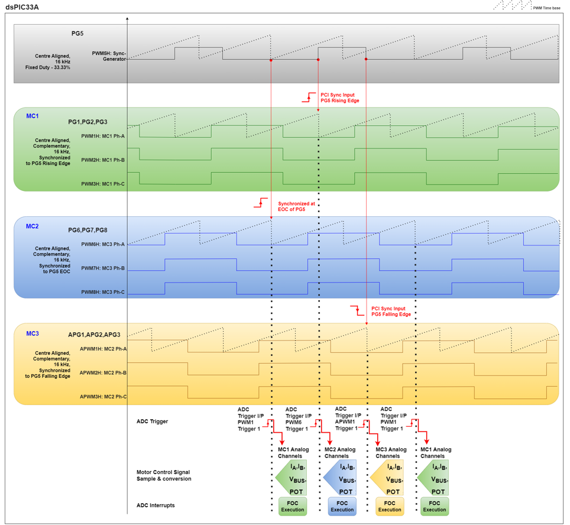
